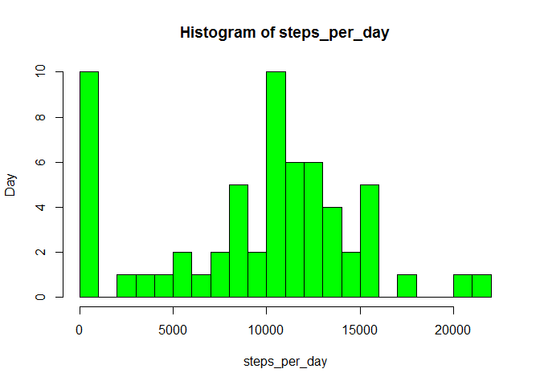
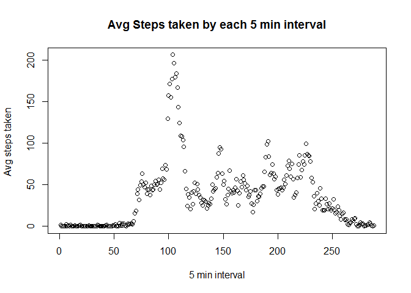
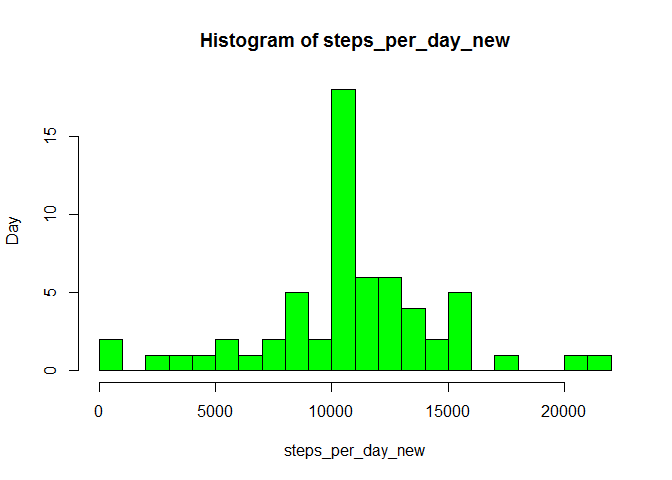
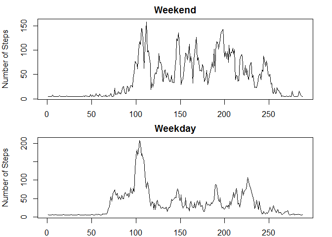

# Reproducible Research: Peer Assessment 1


## Loading and preprocessing the data
Loading activity.csv file into data frame .We will need to convert date column to proper date format. We cann use as.date function for this.


```r
rep_dta<-read.csv("activity.csv")
rep_dta$date<-as.Date(as.character(rep_dta$date))
```


## What is mean total number of steps taken per day?

Using tapply Funciton to calculate Aberage steps per day. Then we can use host function to show histogram.


```r
steps_per_day<-tapply(rep_dta$steps,rep_dta$date,FUN=sum,na.rm=TRUE)

hist(steps_per_day,ylab="Day",col="green",breaks = 20)
```

<!-- -->

Mean Total Number of steps day 

```r
steps_per_day_mean<-tapply(rep_dta$steps,rep_dta$date,FUN=mean,na.rm=TRUE)

print(steps_per_day_mean)
```

```
## 2012-10-01 2012-10-02 2012-10-03 2012-10-04 2012-10-05 2012-10-06 
##        NaN  0.4375000 39.4166667 42.0694444 46.1597222 53.5416667 
## 2012-10-07 2012-10-08 2012-10-09 2012-10-10 2012-10-11 2012-10-12 
## 38.2465278        NaN 44.4826389 34.3750000 35.7777778 60.3541667 
## 2012-10-13 2012-10-14 2012-10-15 2012-10-16 2012-10-17 2012-10-18 
## 43.1458333 52.4236111 35.2048611 52.3750000 46.7083333 34.9166667 
## 2012-10-19 2012-10-20 2012-10-21 2012-10-22 2012-10-23 2012-10-24 
## 41.0729167 36.0937500 30.6284722 46.7361111 30.9652778 29.0104167 
## 2012-10-25 2012-10-26 2012-10-27 2012-10-28 2012-10-29 2012-10-30 
##  8.6527778 23.5347222 35.1354167 39.7847222 17.4236111 34.0937500 
## 2012-10-31 2012-11-01 2012-11-02 2012-11-03 2012-11-04 2012-11-05 
## 53.5208333        NaN 36.8055556 36.7048611        NaN 36.2465278 
## 2012-11-06 2012-11-07 2012-11-08 2012-11-09 2012-11-10 2012-11-11 
## 28.9375000 44.7326389 11.1770833        NaN        NaN 43.7777778 
## 2012-11-12 2012-11-13 2012-11-14 2012-11-15 2012-11-16 2012-11-17 
## 37.3784722 25.4722222        NaN  0.1423611 18.8923611 49.7881944 
## 2012-11-18 2012-11-19 2012-11-20 2012-11-21 2012-11-22 2012-11-23 
## 52.4652778 30.6979167 15.5277778 44.3993056 70.9270833 73.5902778 
## 2012-11-24 2012-11-25 2012-11-26 2012-11-27 2012-11-28 2012-11-29 
## 50.2708333 41.0902778 38.7569444 47.3819444 35.3576389 24.4687500 
## 2012-11-30 
##        NaN
```
Median Total Number of steps day 

```r
steps_per_day_median<-tapply(rep_dta$steps,rep_dta$date,FUN=median,na.rm=TRUE)

print(steps_per_day_median)
```

```
## 2012-10-01 2012-10-02 2012-10-03 2012-10-04 2012-10-05 2012-10-06 
##         NA          0          0          0          0          0 
## 2012-10-07 2012-10-08 2012-10-09 2012-10-10 2012-10-11 2012-10-12 
##          0         NA          0          0          0          0 
## 2012-10-13 2012-10-14 2012-10-15 2012-10-16 2012-10-17 2012-10-18 
##          0          0          0          0          0          0 
## 2012-10-19 2012-10-20 2012-10-21 2012-10-22 2012-10-23 2012-10-24 
##          0          0          0          0          0          0 
## 2012-10-25 2012-10-26 2012-10-27 2012-10-28 2012-10-29 2012-10-30 
##          0          0          0          0          0          0 
## 2012-10-31 2012-11-01 2012-11-02 2012-11-03 2012-11-04 2012-11-05 
##          0         NA          0          0         NA          0 
## 2012-11-06 2012-11-07 2012-11-08 2012-11-09 2012-11-10 2012-11-11 
##          0          0          0         NA         NA          0 
## 2012-11-12 2012-11-13 2012-11-14 2012-11-15 2012-11-16 2012-11-17 
##          0          0         NA          0          0          0 
## 2012-11-18 2012-11-19 2012-11-20 2012-11-21 2012-11-22 2012-11-23 
##          0          0          0          0          0          0 
## 2012-11-24 2012-11-25 2012-11-26 2012-11-27 2012-11-28 2012-11-29 
##          0          0          0          0          0          0 
## 2012-11-30 
##         NA
```

## What is the average daily activity pattern?

We can use tapply function to calculate Average no of steps for each 5 min interval .We stored thsis data into new variable interval_dta. We can use the same to plot .

```r
interval_dta<-tapply(rep_dta$steps,rep_dta$interval,FUN=mean,na.rm=T)
plot(interval_dta,xlab="5 min interval", ylab="Avg steps taken ",main="Avg Steps taken by each 5 min interval")
```

<!-- -->
## Imputing missing values

Total Number of Missing values in dataset

```r
sum(is.na(rep_dta))
```

```
## [1] 2304
```

Creating new dataset with  missing values filled 


```r
new_dta<-rep_dta
new_dta[is.na(new_dta$steps),1]<-mean(new_dta$steps,na.rm = TRUE)
steps_per_day_new<-tapply(new_dta$steps,new_dta$date,FUN=sum)
```
Histgram with new dataset


```r
hist(steps_per_day_new,ylab="Day",col="green",breaks = 20)
```

<!-- -->


Mean Total Number of steps day for new dataset


```r
steps_per_day_mean_new<-tapply(new_dta$steps,new_dta$date,FUN=mean,na.rm=TRUE)

print(steps_per_day_mean_new)
```

```
## 2012-10-01 2012-10-02 2012-10-03 2012-10-04 2012-10-05 2012-10-06 
## 37.3825996  0.4375000 39.4166667 42.0694444 46.1597222 53.5416667 
## 2012-10-07 2012-10-08 2012-10-09 2012-10-10 2012-10-11 2012-10-12 
## 38.2465278 37.3825996 44.4826389 34.3750000 35.7777778 60.3541667 
## 2012-10-13 2012-10-14 2012-10-15 2012-10-16 2012-10-17 2012-10-18 
## 43.1458333 52.4236111 35.2048611 52.3750000 46.7083333 34.9166667 
## 2012-10-19 2012-10-20 2012-10-21 2012-10-22 2012-10-23 2012-10-24 
## 41.0729167 36.0937500 30.6284722 46.7361111 30.9652778 29.0104167 
## 2012-10-25 2012-10-26 2012-10-27 2012-10-28 2012-10-29 2012-10-30 
##  8.6527778 23.5347222 35.1354167 39.7847222 17.4236111 34.0937500 
## 2012-10-31 2012-11-01 2012-11-02 2012-11-03 2012-11-04 2012-11-05 
## 53.5208333 37.3825996 36.8055556 36.7048611 37.3825996 36.2465278 
## 2012-11-06 2012-11-07 2012-11-08 2012-11-09 2012-11-10 2012-11-11 
## 28.9375000 44.7326389 11.1770833 37.3825996 37.3825996 43.7777778 
## 2012-11-12 2012-11-13 2012-11-14 2012-11-15 2012-11-16 2012-11-17 
## 37.3784722 25.4722222 37.3825996  0.1423611 18.8923611 49.7881944 
## 2012-11-18 2012-11-19 2012-11-20 2012-11-21 2012-11-22 2012-11-23 
## 52.4652778 30.6979167 15.5277778 44.3993056 70.9270833 73.5902778 
## 2012-11-24 2012-11-25 2012-11-26 2012-11-27 2012-11-28 2012-11-29 
## 50.2708333 41.0902778 38.7569444 47.3819444 35.3576389 24.4687500 
## 2012-11-30 
## 37.3825996
```
Median Total Number of steps day for new dataset

```r
steps_per_day_median_new<-tapply(new_dta$steps,new_dta$date,FUN=median,na.rm=TRUE)

print(steps_per_day_median_new)
```

```
## 2012-10-01 2012-10-02 2012-10-03 2012-10-04 2012-10-05 2012-10-06 
##    37.3826     0.0000     0.0000     0.0000     0.0000     0.0000 
## 2012-10-07 2012-10-08 2012-10-09 2012-10-10 2012-10-11 2012-10-12 
##     0.0000    37.3826     0.0000     0.0000     0.0000     0.0000 
## 2012-10-13 2012-10-14 2012-10-15 2012-10-16 2012-10-17 2012-10-18 
##     0.0000     0.0000     0.0000     0.0000     0.0000     0.0000 
## 2012-10-19 2012-10-20 2012-10-21 2012-10-22 2012-10-23 2012-10-24 
##     0.0000     0.0000     0.0000     0.0000     0.0000     0.0000 
## 2012-10-25 2012-10-26 2012-10-27 2012-10-28 2012-10-29 2012-10-30 
##     0.0000     0.0000     0.0000     0.0000     0.0000     0.0000 
## 2012-10-31 2012-11-01 2012-11-02 2012-11-03 2012-11-04 2012-11-05 
##     0.0000    37.3826     0.0000     0.0000    37.3826     0.0000 
## 2012-11-06 2012-11-07 2012-11-08 2012-11-09 2012-11-10 2012-11-11 
##     0.0000     0.0000     0.0000    37.3826    37.3826     0.0000 
## 2012-11-12 2012-11-13 2012-11-14 2012-11-15 2012-11-16 2012-11-17 
##     0.0000     0.0000    37.3826     0.0000     0.0000     0.0000 
## 2012-11-18 2012-11-19 2012-11-20 2012-11-21 2012-11-22 2012-11-23 
##     0.0000     0.0000     0.0000     0.0000     0.0000     0.0000 
## 2012-11-24 2012-11-25 2012-11-26 2012-11-27 2012-11-28 2012-11-29 
##     0.0000     0.0000     0.0000     0.0000     0.0000     0.0000 
## 2012-11-30 
##    37.3826
```

*Replacing Missing values did affect the meaan and median of datasets. With replacing NA  with mean ,count of zero values reduced .data is now normall distributed. 


## Are there differences in activity patterns between weekdays and weekends?
We can seperate data with the help of weekdays function . We have added one more column as Day to dataset to show whether it is weekday or weekend.

We can plot two line plots seperatly and see comparison between two categories.


```r
new_dta$day<-weekdays(new_dta$date)
new_dta[new_dta$day=="Monday"|new_dta$day=="Tuesday"|new_dta$day=="Wednesday"|new_dta$day=="Thursday"|new_dta$day=="Friday",4]<-"Weekday"
new_dta[new_dta$day=="Sunday"|new_dta$day=="Saturday",4]<-"Weekend"
wkd<-new_dta[new_dta$day=="Weekday",]
wkn<-new_dta[new_dta$day=="Weekend",]

interval_dta_weekday<-tapply(wkd$steps,wkd$interval,FUN=mean,na.rm=T)


interval_dta_weekend<-tapply(wkn$steps,wkn$interval,FUN=mean,na.rm=T)
par(mfrow=c(2,1),mar=c(2,4,2,2))
plot(interval_dta_weekend,type="l",main="Weekend",xlab="Interval",ylab="Number of Steps")
plot(interval_dta_weekday,type="l",main="Weekday",xlab="Interval",ylab="Number of Steps")
```

<!-- -->


